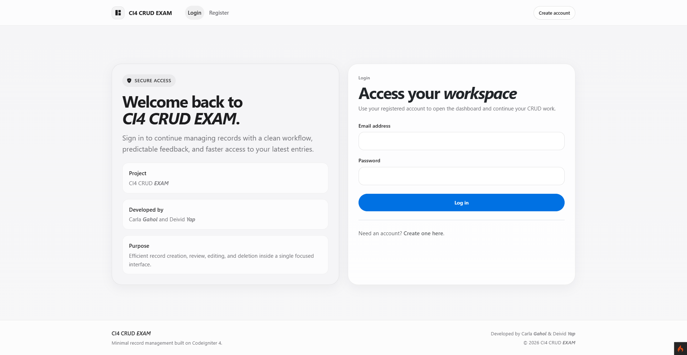
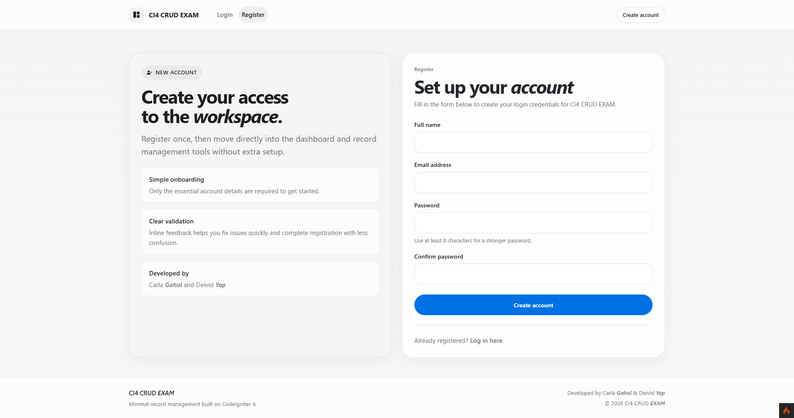
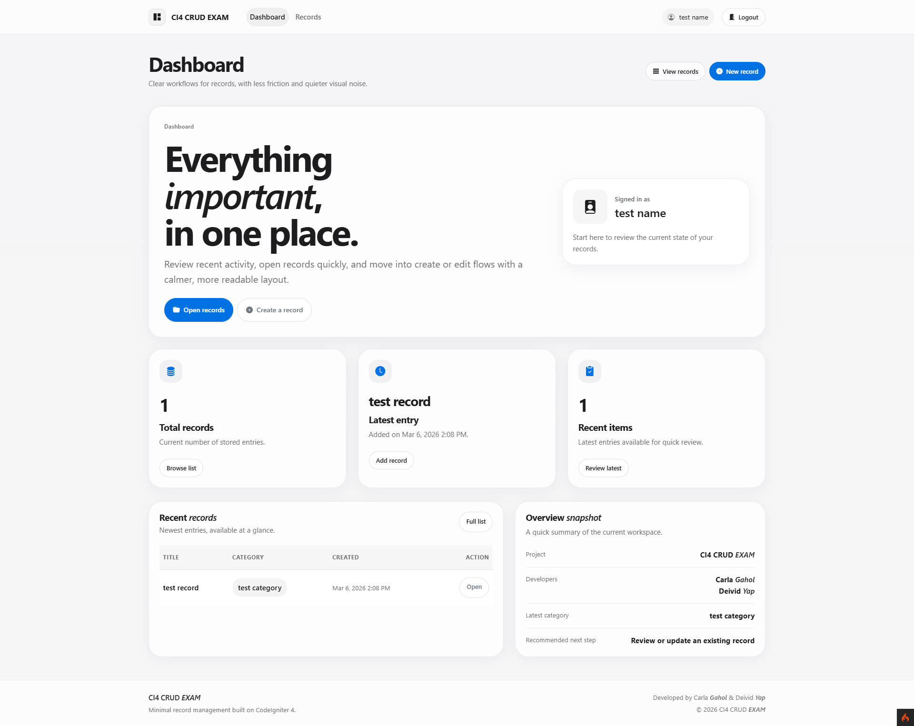
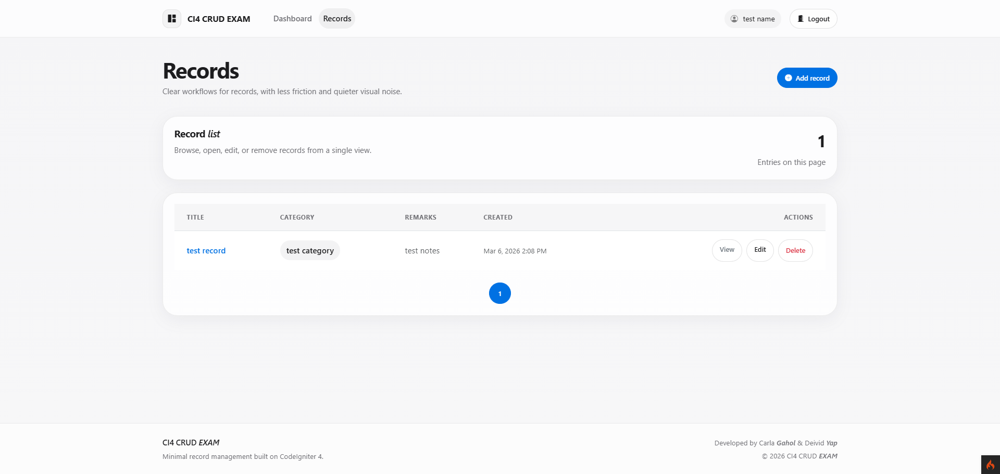

# CodeIgniter 4 Authenticated CRUD Project

## Project Details
- **Project Title:** CodeIgniter 4 Authenticated CRUD Project
- **Author:** Angelo
- **Submission Date:** March 6, 2026
- **Framework:** CodeIgniter 4
- **Frontend Library:** Bootstrap 5
- **Database:** MySQL / MariaDB

## Project Overview
This project is a web-based CRUD application built with CodeIgniter 4. It includes a custom authentication system and a protected `records` module that follows RESTful conventions.

The application allows an authenticated user to:
- register and log in
- access a protected dashboard
- create, view, update, and delete records
- browse records in a Bootstrap `table-striped` layout
- open a detail page for each record
- use server-side validation and flash messages during create and update actions
- delete records with a JavaScript confirmation prompt
- navigate through paginated record results using CodeIgniter's Pager library

## Screenshots

### Login Page


### Register Page


### Dashboard


### Records Page


## Features Implemented
- **Authentication Module**
   - Register new users
   - Login and logout
   - Password hashing using `PASSWORD_BCRYPT`
- **Route Protection**
   - `AuthFilter` protects the dashboard and all `records` routes
   - `GuestFilter` prevents logged-in users from reopening login and registration pages
- **RESTful CRUD for `records`**
   - `index`, `show`, `new`, `create`, `edit`, `update`, `delete`
   - Uses method spoofing for `PUT` and `DELETE`
- **UI and Validation**
   - Bootstrap cards, tables, buttons, and forms
   - Inline validation errors
   - success and error flash messages
   - confirm prompt before delete
- **Database Support**
   - SQL import file included
   - database configuration supported through `.env` or `app/Config/Database.php`

## Instructor Setup Guide
Please follow these steps to run and evaluate the project.

### 1. System Requirements
- PHP 8.1 or higher
- Composer
- MySQL or MariaDB
- A local web stack such as XAMPP, Laragon, WAMP, or similar

### 2. Open the Project
1. Extract or clone the project.
2. Open a terminal in the project root:
    `c:\Users\Angelo\Desktop\Agent\00-playground\ci4-crud-exam`

### 3. Install Dependencies
If the `vendor/` folder is not available, run:

```bash
composer install
```

### 4. Import the Provided SQL Database
The project includes a ready-to-import SQL file in the root directory:

`ci4_crud_exam.sql`

#### Option A: Import using phpMyAdmin
1. Open phpMyAdmin.
2. Create a database named `ci4_crud_exam`.
3. Select the database.
4. Click the `Import` tab.
5. Choose the file `ci4_crud_exam.sql`.
6. Start the import.

#### Option B: Import using MySQL command line
1. Create the database if it does not exist.
2. Run:

```bash
mysql -u root -p ci4_crud_exam < ci4_crud_exam.sql
```

The SQL file creates the required tables and inserts:
- one default admin user
- sample records for CRUD testing

### 5. Configure the Environment File
This project includes an `env` template file. Rename it to `.env` if it has not been renamed yet.

Recommended `.env` settings:

```env
CI_ENVIRONMENT = development

database.default.hostname = localhost
database.default.database = ci4_crud_exam
database.default.username = root
database.default.password =
database.default.DBDriver = MySQLi
database.default.port = 3306
```

If your local environment uses a different database name, username, password, or port, update the values accordingly.

### 6. Alternative Database Configuration
If the instructor prefers not to use `.env`, the same settings can be edited directly in:

`app/Config/Database.php`

Current default values in that file are:

```php
'hostname' => 'localhost',
'username' => 'root',
'password' => '',
'database' => 'ci4_crud_exam',
'DBDriver' => 'MySQLi',
'port'     => 3306,
```

### 7. Run the Application
Start the local development server:

```bash
php spark serve
```

Then open:

`http://localhost:8080`

## Default Testing Credentials
After importing `ci4_crud_exam.sql`, use the following credentials:

- **Admin Email:** `admin@example.com`
- **Admin Password:** `password123`

You may also create a new user through the registration page if needed.

## Default Navigation Flow for Checking
1. Open `http://localhost:8080`
2. Log in using the default admin account
3. Confirm that the dashboard is visible only after authentication
4. Open the `Records` module
5. Test the following:
    - view all records in the index table
    - click a title to open the detail page
    - create a new record
    - edit an existing record
    - delete a record after confirmation
    - verify flash messages after create, update, and delete actions
    - verify pagination when the table contains enough records

## Important Files
- `app/Controllers/Auth.php` - handles registration, login, and logout
- `app/Controllers/Records.php` - handles the RESTful CRUD module
- `app/Models/UserModel.php` - manages users and password hashing
- `app/Models/RecordModel.php` - manages record validation and persistence
- `app/Filters/AuthFilter.php` - protects authenticated routes
- `app/Filters/GuestFilter.php` - redirects authenticated users away from guest-only routes
- `app/Config/Routes.php` - contains the protected `records` resource routes
- `app/Views/records/` - contains the create, edit, index, show, and shared form views
- `ci4_crud_exam.sql` - ready-to-import database dump with sample data

## Notes for Evaluation
- The CRUD module uses protected RESTful routes generated through CodeIgniter resource routing.
- The `records` index uses Bootstrap's `table-striped` class as required.
- The show page displays the selected record in a clean Bootstrap card layout.
- The create and edit forms use `form-label` and `form-control` styling.
- All `records` routes require authentication through the `auth` filter.
- Delete operations perform a hard delete and redirect back to the index with a flash message.

## Optional Fallback if SQL Import Is Skipped
If the SQL file is not imported, the instructor may still create the schema by using the included migrations. However, the recommended evaluation path is to import `ci4_crud_exam.sql` because it also provides a default admin account and sample records.

```bash
php spark migrate
```

If migrations are used instead of the SQL dump, a user can be created manually through the `/register` page.
